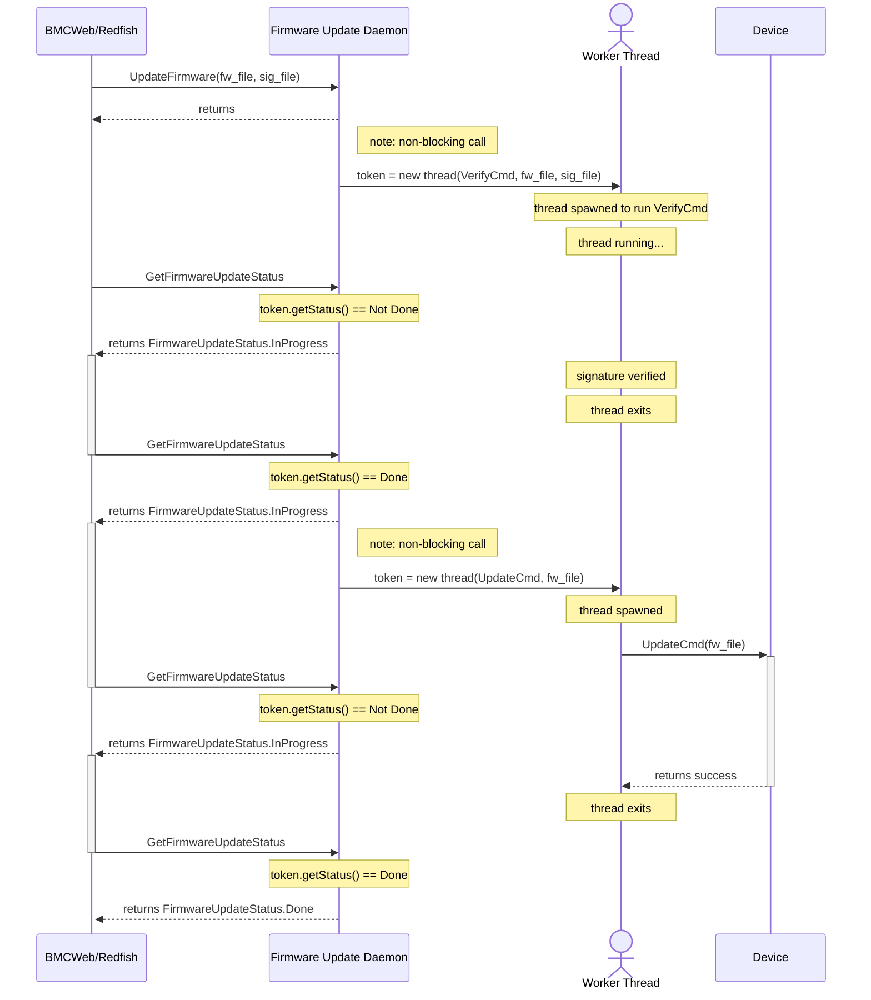
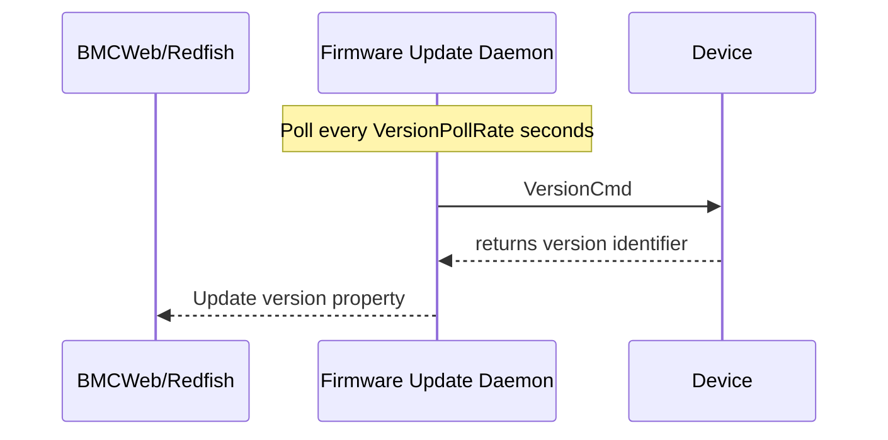

```mermaid
sequenceDiagram;
participant APP as BMCWeb/Redfish
participant FWD as Firmware Update Daemon
actor WOK as Worker Thread
participant DEV as Device

APP ->> FWD: UpdateFirmware(fw_file, sig_file)
FWD -->> APP: returns
note right of FWD: note: non-blocking call
FWD ->> WOK: token = new thread(VerifyCmd, fw_file, sig_file)
note over WOK: thread spawned to run VerifyCmd
note over WOK: thread running...
APP ->> FWD: GetFirmwareUpdateStatus
note over FWD: token.getStatus() == Not Done
FWD -->>+ APP: returns FirmwareUpdateStatus.InProgress

note over WOK: signature verified
note over WOK: thread exits
APP ->>- FWD: GetFirmwareUpdateStatus
note over FWD: token.getStatus() == Done
FWD -->>+ APP: returns FirmwareUpdateStatus.InProgress

note right of FWD: note: non-blocking call
FWD ->> WOK: token = new thread(UpdateCmd, fw_file)
note over WOK: thread spawned
WOK ->>+ DEV: UpdateCmd(fw_file)
APP ->>- FWD: GetFirmwareUpdateStatus
note over FWD: token.getStatus() == Not Done
FWD -->>+ APP: returns FirmwareUpdateStatus.InProgress

DEV -->>- WOK: returns success
note over WOK: thread exits
APP ->>- FWD: GetFirmwareUpdateStatus
note over FWD: token.getStatus() == Done
FWD -->>+ APP: returns FirmwareUpdateStatus.Done
```

```mermaid
sequenceDiagram;
participant APP as BMCWeb/Redfish
participant FWD as Firmware Update Daemon
participant DEV as Device

note over FWD: Poll every VersionPollRate seconds
FWD ->> DEV: VersionCmd
DEV -->> FWD: returns version identifier
FWD -->> APP: Update version property
```

