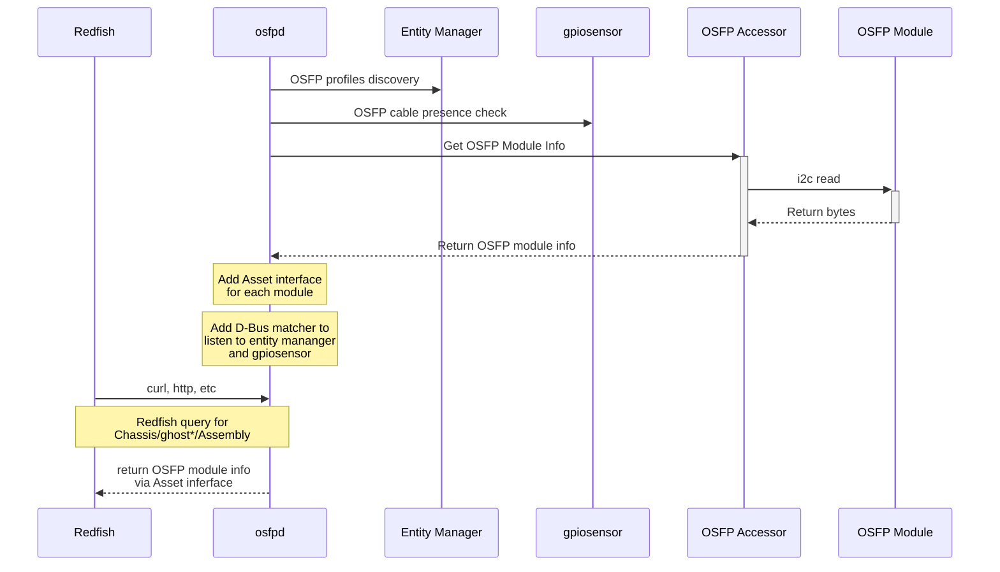

```mermaid
sequenceDiagram;
participant APP as Redfish
participant OSD as osfpd
participant EMR as Entity Manager
participant SEN as gpiosensor
participant OOB as OSFP Accessor
participant MOD as OSFP Module

OSD ->> EMR: OSFP profiles discovery
OSD ->> SEN: OSFP cable presence check
OSD ->>+ OOB: Get OSFP Module Info
OOB ->>+ MOD: i2c read
MOD -->>- OOB: Return bytes
OOB -->>- OSD: Return OSFP module info
note over OSD: Add Asset interface<br/>for each module
note over OSD: Add D-Bus matcher to<br/>listen to entity mananger<br/>and gpiosensor
APP ->> OSD: curl, http, etc
note over APP, OSD: Redfish query for<br/>Chassis/ghost*/Assembly
OSD -->> APP: return OSFP module info<br/>via Asset inferface
```
