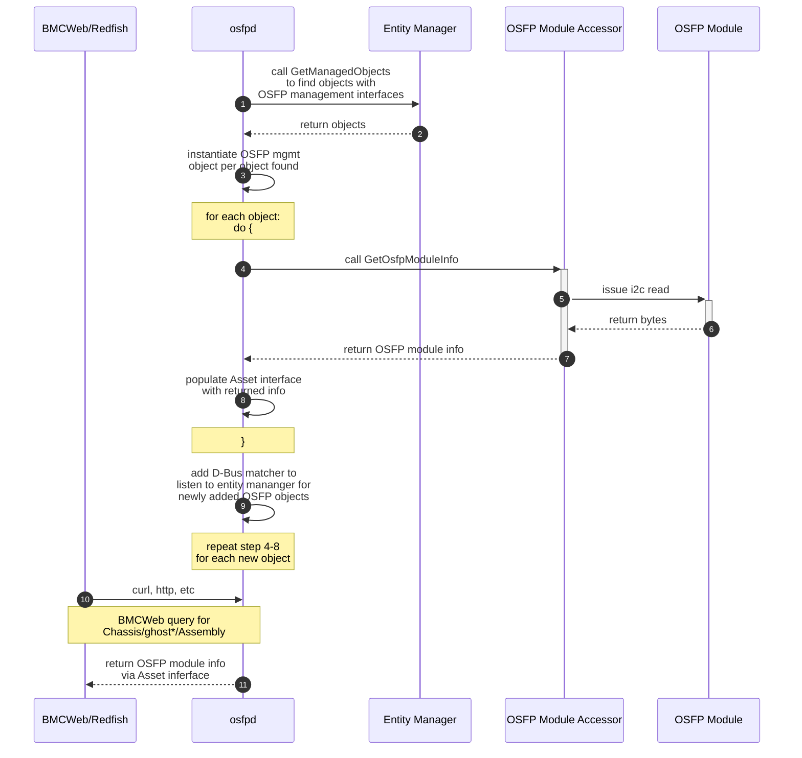

```mermaid
sequenceDiagram;
participant APP as BMCWeb/Redfish
participant OSD as osfpd
participant EMR as Entity Manager
participant OOB as OSFP Module Accessor
participant MOD as OSFP Module

autonumber
OSD ->> EMR: call GetManagedObjects<br/>to find objects with<br/>OSFP management interfaces
EMR -->> OSD: return objects
OSD ->> OSD: instantiate OSFP mgmt<br/>object per object found
note over OSD: for each object:<br/>do {
OSD ->>+ OOB: call GetOsfpModuleInfo
OOB ->>+ MOD: issue i2c read
MOD -->>- OOB: return bytes
OOB -->>- OSD: return OSFP module info
OSD ->> OSD: populate Asset interface<br/>with returned info
note over OSD: }
OSD ->> OSD: add D-Bus matcher to<br/>listen to entity mananger for<br/>newly added OSFP objects
note over OSD: repeat step 4-8<br/>for each new object
APP ->> OSD: curl, http, etc
note over APP, OSD: BMCWeb query for<br/>Chassis/ghost*/Assembly
OSD -->> APP: return OSFP module info<br/>via Asset inferface
```
