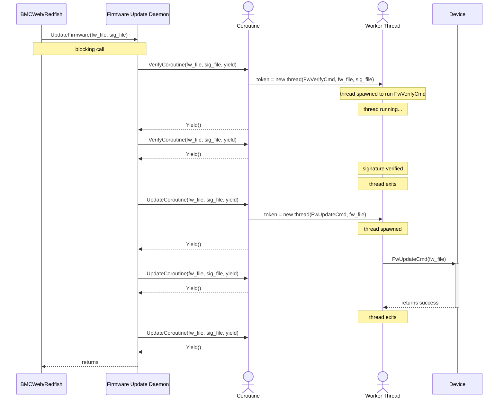

```mermaid
sequenceDiagram;
participant APP as BMCWeb/Redfish
participant FWD as Firmware Update Daemon
actor COR as Coroutine
actor WOK as Worker Thread
participant DEV as Device

APP ->> FWD: UpdateFirmware(fw_file, sig_file)
note over APP, FWD: blocking call
FWD ->> COR: VerifyCoroutine(fw_file, sig_file, yield)
COR ->> WOK: token = new thread(FwVerifyCmd, fw_file, sig_file)
note over WOK: thread spawned to run FwVerifyCmd
note over WOK: thread running...
COR -->> FWD: Yield()
FWD ->> COR: VerifyCoroutine(fw_file, sig_file, yield)
COR -->> FWD: Yield()
note over WOK: signature verified
note over WOK: thread exits
FWD ->> COR: UpdateCoroutine(fw_file, sig_file, yield)
COR ->> WOK: token = new thread(FwUpdateCmd, fw_file)
note over WOK: thread spawned
COR -->> FWD: Yield()
WOK ->>+ DEV: FwUpdateCmd(fw_file)
FWD ->> COR: UpdateCoroutine(fw_file, sig_file, yield)
COR -->> FWD: Yield()
DEV -->>- WOK: returns success
note over WOK: thread exits
FWD ->> COR: UpdateCoroutine(fw_file, sig_file, yield)
COR -->> FWD: Yield()
FWD -->> APP: returns
```
