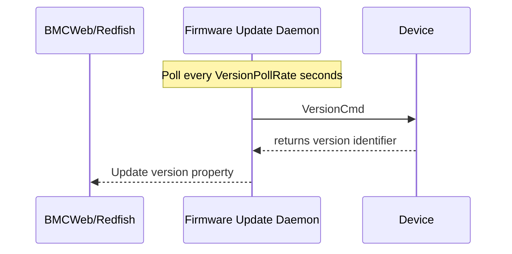

```mermaid
sequenceDiagram;
participant APP as BMCWeb/Redfish
participant FWD as Firmware Update Daemon
participant DEV as Device

note over FWD: Poll every VersionPollRate seconds
FWD ->> DEV: VersionCmd
DEV -->> FWD: returns version identifier
FWD -->> APP: Update version property
```
